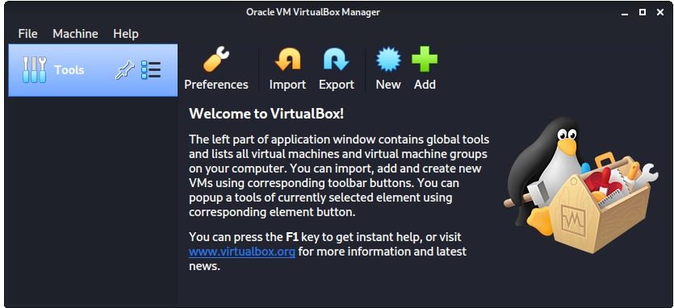
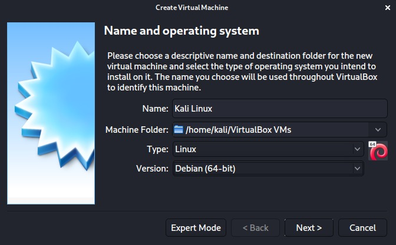

<!-- Instruction documentation written by Sol Kim -->

<!-- PROJECT LOGO -->
 

  

  <h3 align="center">PACTF2023 Problems</h3>

  

    Problem setup instructions and how to set up your own linux enviro for development.
  

<!-- TABLE OF CONTENTS -->

  
Table of Contents

  <ol>
    <li><a href="#get-this-repo-onto-your-computer">Download</a></li>
    <li><a href="#get-linux-terminal">Get Linux</a></li>
    <li><a href="#contributing">Contributing</a></li>
    <li><a href="#license">License</a></li>
    <li><a href="#contact">Contact</a></li>
    <li><a href="#acknowledgments">Acknowledgments</a></li>
  </ol>

<!-- PROBLEM TEMPLATE -->
## Get this repo onto your computer

### For the absolute beginner to github (I don't even have an account, help me!)
* Create an account, remember the username and password
* Download <a href="https://desktop.github.com/">github desktop</a> (easiest way to clone) onto your computer
* After you've logged into github desktop, click `Code`>`Open with GitHub Desktop`
* Choose the destination for where you'll keep it

### I have an account and a terminal
* `cd` into the directory you want this repo to be within
* `git clone https://github.com/Dynosol/pactf23.git`
* Enter your username
* Enter your Personal Access Token where it asks for your password (it won't show, but press enter anyway)

### I don't have a PAT
* Within github.com go to `Settings`>`Developer settings`>`Personal access tokens`>`Generate new token`
* Enter your password
* Name it whatever in the `Note` section; doesn't really matter what
* Just select `repo`, unless you want something else and know what you're doing
* Scroll down and `Generate token`
* <b>COPY PASTE</b> the token that looks like `ghp_<something>` into a text file or save it in some way. You <b>WONT</b> be able to see it ever again.
* Use this for your password in the terminal

If you are unfamiliar with git commands, use `man git` or read documentation <a href="https://git-scm.com/docs">here</a>

Check [this](https://jarv.is/notes/how-to-pull-request-fork-github/) out for instructions on how to make your own pull requests

(<a href="#top">back to top</a>)

## Get Linux Terminal

### Linux terminal running on Windows (WSL)
* An ubuntu-based WSL should be pre-installed on your Windows 10/11 machine, but if you want Debian (recommended) or if you don't have it for some reason:
* run `wsl --install -d Debian` within the Windows PowerShell on an admin account (you can just search powershell in windows searchbar)
* Installing [Windows Terminal](https://docs.microsoft.com/en-us/windows/terminal/get-started) is recommended

### Virtual Machine (beginner)
* For beginners I'd recommend getting a VM-based distro of Kali Linux for CTF development and practice
* Virtual Machine is useful for not destroying your own computer (I've destroyed several VMs)
* Get [VMBox 6.1](https://www.virtualbox.org/wiki/Downloads)
* Get [Kali Linux for VirtualBox](https://kali.download/virtual-images/kali-2022.2/kali-linux-2022.2-virtualbox-amd64.ova)

### Virtual Machine (beginner++)
* If you don't want the VM-based distro, download the [bare metal iso](https://cdimage.kali.org/kali-2022.2/kali-linux-2022.2-installer-amd64.iso)
* Get [VMBox 6.1](https://www.virtualbox.org/wiki/Downloads)
* Boot VMBox and press NEW:

* Name it whatever but choose Linux and Debian (change download folder if you want)

* Depending on the memory on your system, choose less than half of what you've got.
* [Check RAM on MAC](https://www.macinstruct.com/tutorials/see-how-much-ram-is-installed-in-your-mac/) [Check RAM on Windows 10](https://www.crucial.com/articles/about-memory/how-to-check-ram-windows-10) [Check RAM on Windows 11](https://www.xda-developers.com/find-out-ram-specs-windows-11/)
* Choose `Create a virtual hard disk now`
* Choose `VDI`
* Choose `Dynamically allocated`
* Set a size that makes sense for how much you have on your system. Minimum 10 GB; I'd recommend between 30-80 GB.
* Click `Create`
* Go into settings, make sure `System`>`Motherboard`>`Hard Disk` and `Optical` are enabled.
* Set `System`>`Processor`>`Processor(s)` to less than half again; 2 should be fine. 1 is okay too.
* Set `Display`>`Screen`>`Video Memory:` to max.
* 

(<a href="#top">back to top</a>)

<!-- GETTING STARTED -->
## Getting Started

<!-- ROADMAP -->
## Roadmap

- [x] Add Changelog
- [x] Add back to top links
- [ ] Add Additional Templates w/ Examples
- [ ] Add "components" document to easily copy & paste sections of the readme
- [ ] Multi-language Support
    - [ ] Chinese
    - [ ] Spanish

See the [open issues](https://github.com/othneildrew/Best-README-Template/issues) for a full list of proposed features (and known issues).

(<a href="#top">back to top</a>)

<!-- CONTACT -->
## Contact

Your Name - [@your_twitter](https://twitter.com/your_username) - email@example.com

Project Link: [https://github.com/your_username/repo_name](https://github.com/your_username/repo_name)

(<a href="#top">back to top</a>)

