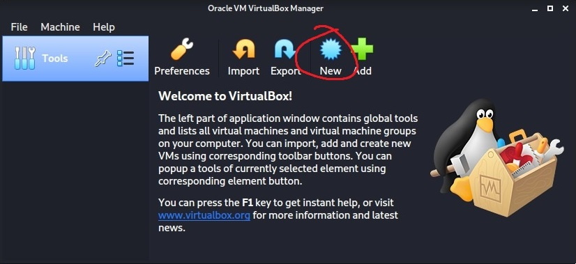

<div id="top"></div>

<!-- Instruction documentation written by Sol Kim -->

<!-- PROJECT LOGO -->
<br />
<div align="center">
  <a href="https://github.com/Dynosol/pactf23">
    
  </a>

  <h3 align="center">PACTF2023 Problems</h3>

  <p align="center">
    Problem setup instructions and how to set up your own linux enviro for development.
  </p>
</div>


<!-- TABLE OF CONTENTS -->
<details>
  <summary>Table of Contents</summary>
  <ol>
    <li><a href="#get-this-repo-onto-your-computer">Download</a></li>
    <li><a href="#get-linux-terminal">Get Linux</a></li>
    <li><a href="#contributing">Contributing</a></li>
    <li><a href="#license">License</a></li>
    <li><a href="#contact">Contact</a></li>
    <li><a href="#acknowledgments">Acknowledgments</a></li>
  </ol>
</details>


<!-- PROBLEM TEMPLATE -->
## Get this repo onto your computer

### For the absolute beginner to github (I don't even have an account, help me!)
* Create an account, remember the username and password
* Download <a href="https://desktop.github.com/">github desktop</a> (easiest way to clone) onto your computer
* After you've logged into github desktop, click `Code`>`Open with GitHub Desktop`
* Choose the destination for where you'll keep it

### I have an account and a terminal
* `cd` into the directory you want this repo to be within
* `git clone https://github.com/Dynosol/pactf23.git`
* Enter your username
* Enter your Personal Access Token where it asks for your password (it won't show, but press enter anyway)

### I don't have a PAT
* Within github.com go to `Settings`>`Developer settings`>`Personal access tokens`>`Generate new token`
* Enter your password
* Name it whatever in the `Note` section; doesn't really matter what
* Just select `repo`, unless you want something else and know what you're doing
* Scroll down and `Generate token`
* <b>COPY PASTE</b> the token that looks like `ghp_<something>` into a text file or save it in some way. You <b>WONT</b> be able to see it ever again.
* Use this for your password in the terminal

If you are unfamiliar with git commands, use `man git` or read documentation <a href="https://git-scm.com/docs">here</a>

Check [this](https://jarv.is/notes/how-to-pull-request-fork-github/) out for instructions on how to make your own pull requests

<p align="right">(<a href="#top">back to top</a>)</p>


## Get Linux Terminal

### Linux terminal running on Windows (WSL)
* An ubuntu-based WSL should be pre-installed on your Windows 10/11 machine, but if you want Debian (recommended) or if you don't have it for some reason:
* run `wsl --install -d Debian` within the Windows PowerShell on an admin account (you can just search powershell in windows searchbar)
* Installing [Windows Terminal](https://docs.microsoft.com/en-us/windows/terminal/get-started) is recommended

### Virtual Machine (beginner)
* For beginners I'd recommend getting a VM-based distro of Kali Linux for CTF development and practice
* Virtual Machine is useful for not destroying your own computer (I've destroyed several VMs)
* Get [VMBox 6.1](https://www.virtualbox.org/wiki/Downloads)
* Get [Kali Linux for VirtualBox](https://kali.download/virtual-images/kali-2022.2/kali-linux-2022.2-virtualbox-amd64.ova)
* Boot VMBox and press NEW:



### Virtual Machine (beginner++)
* If you don't want the VM-based distro, download the [bare metal iso](https://cdimage.kali.org/kali-2022.2/kali-linux-2022.2-installer-amd64.iso)
* Get [VMBox 6.1](https://www.virtualbox.org/wiki/Downloads)
* 


<p align="right">(<a href="#top">back to top</a>)</p>


<!-- GETTING STARTED -->
## Getting Started

This is an example of how you may give instructions on setting up your project locally.
To get a local copy up and running follow these simple example steps.

### Prerequisites

This is an example of how to list things you need to use the software and how to install them.
* npm
  ```sh
  npm install npm@latest -g
  ```

### Installation

_Below is an example of how you can instruct your audience on installing and setting up your app. This template doesn't rely on any external dependencies or services._

1. Get a free API Key at [https://example.com](https://example.com)
2. Clone the repo
   ```sh
   git clone https://github.com/your_username_/Project-Name.git
   ```
3. Install NPM packages
   ```sh
   npm install
   ```
4. Enter your API in `config.js`
   ```js
   const API_KEY = 'ENTER YOUR API';
   ```

<p align="right">(<a href="#top">back to top</a>)</p>


<!-- USAGE EXAMPLES -->
## Usage

Use this space to show useful examples of how a project can be used. Additional screenshots, code examples and demos work well in this space. You may also link to more resources.

_For more examples, please refer to the [Documentation](https://example.com)_

<p align="right">(<a href="#top">back to top</a>)</p>


<!-- ROADMAP -->
## Roadmap

- [x] Add Changelog
- [x] Add back to top links
- [ ] Add Additional Templates w/ Examples
- [ ] Add "components" document to easily copy & paste sections of the readme
- [ ] Multi-language Support
    - [ ] Chinese
    - [ ] Spanish

See the [open issues](https://github.com/othneildrew/Best-README-Template/issues) for a full list of proposed features (and known issues).

<p align="right">(<a href="#top">back to top</a>)</p>


<!-- CONTRIBUTING -->
## Contributing

Contributions are what make the open source community such an amazing place to learn, inspire, and create. Any contributions you make are **greatly appreciated**.

If you have a suggestion that would make this better, please fork the repo and create a pull request. You can also simply open an issue with the tag "enhancement".
Don't forget to give the project a star! Thanks again!

1. Fork the Project
2. Create your Feature Branch (`git checkout -b feature/AmazingFeature`)
3. Commit your Changes (`git commit -m 'Add some AmazingFeature'`)
4. Push to the Branch (`git push origin feature/AmazingFeature`)
5. Open a Pull Request

<p align="right">(<a href="#top">back to top</a>)</p>


<!-- LICENSE -->
## License

Distributed under the MIT License. See `LICENSE.txt` for more information.

<p align="right">(<a href="#top">back to top</a>)</p>


<!-- CONTACT -->
## Contact

Your Name - [@your_twitter](https://twitter.com/your_username) - email@example.com

Project Link: [https://github.com/your_username/repo_name](https://github.com/your_username/repo_name)

<p align="right">(<a href="#top">back to top</a>)</p>


<!-- ACKNOWLEDGMENTS -->
## Acknowledgments

Use this space to list resources you find helpful and would like to give credit to. I've included a few of my favorites to kick things off!

* [Choose an Open Source License](https://choosealicense.com)
* [GitHub Emoji Cheat Sheet](https://www.webpagefx.com/tools/emoji-cheat-sheet)
* [Malven's Flexbox Cheatsheet](https://flexbox.malven.co/)
* [Malven's Grid Cheatsheet](https://grid.malven.co/)
* [Img Shields](https://shields.io)
* [GitHub Pages](https://pages.github.com)
* [Font Awesome](https://fontawesome.com)
* [React Icons](https://react-icons.github.io/react-icons/search)

<p align="right">(<a href="#top">back to top</a>)</p>


<!-- MARKDOWN LINKS & IMAGES -->
<!-- https://www.markdownguide.org/basic-syntax/#reference-style-links -->
[contributors-shield]: https://img.shields.io/github/contributors/othneildrew/Best-README-Template.svg?style=for-the-badge
[contributors-url]: https://github.com/othneildrew/Best-README-Template/graphs/contributors
[forks-shield]: https://img.shields.io/github/forks/othneildrew/Best-README-Template.svg?style=for-the-badge
[forks-url]: https://github.com/othneildrew/Best-README-Template/network/members
[stars-shield]: https://img.shields.io/github/stars/othneildrew/Best-README-Template.svg?style=for-the-badge
[stars-url]: https://github.com/othneildrew/Best-README-Template/stargazers
[issues-shield]: https://img.shields.io/github/issues/othneildrew/Best-README-Template.svg?style=for-the-badge
[issues-url]: https://github.com/othneildrew/Best-README-Template/issues
[license-shield]: https://img.shields.io/github/license/othneildrew/Best-README-Template.svg?style=for-the-badge
[license-url]: https://github.com/othneildrew/Best-README-Template/blob/master/LICENSE.txt
[linkedin-shield]: https://img.shields.io/badge/-LinkedIn-black.svg?style=for-the-badge&logo=linkedin&colorB=555
[linkedin-url]: https://linkedin.com/in/othneildrew
[product-screenshot]: images/screenshot.png
